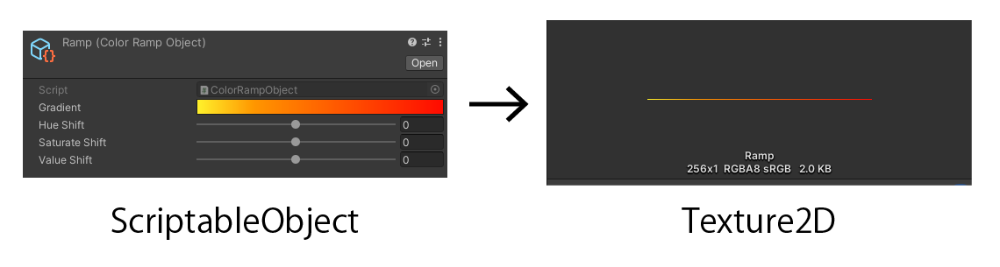
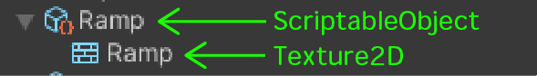
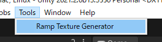
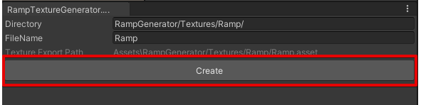
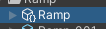

# Unity-RampTextureGenerator
This tool generates a Ramp(Texture2D) from a ScriptableObject.   

 

The Texture2D of the ramp will be generated inside the ScriptableObject.   

  

# How to use
Select *Tools -> Ramp Texture Generator*. 

 

 

Click the *Create* button. 

Then, Ramp data will be generated. 

